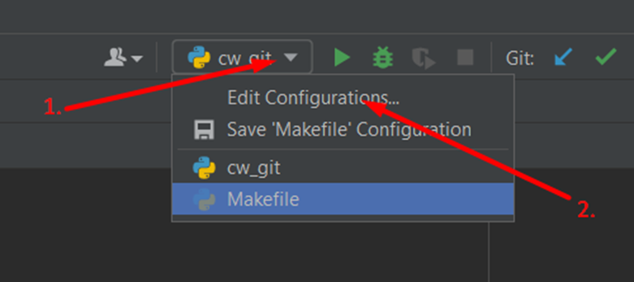
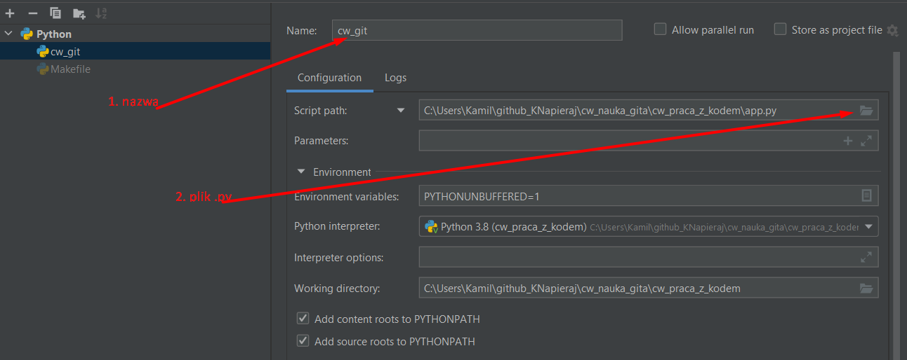

Witam w moim repozytorium, aby uruchomić naszą aplikacje
niezbedne będzie zainstalowanie flaska, pylinta i utworzenie wirtualnego środowiska.

Instrukcja dla wirtualnego środowiska:  
https://docs.python.org/3/library/venv.html  
Możemy to również zrobić w poziomu samego PyCharm`a  
 
 

Aby zainstalować flaska  
dla windows:  
Korzysając z PyCharma w terminalu wpisujemy  
`pip install flask`  
a następnie  
`flask run`

ubuntu:  
w konsoli wpisujemy  
`sudo apt install flask`

W repozytorium znajduej się plik Makefile,  
który jest pomocnym skryptem włączającym flaska i instalującym requirements`y.